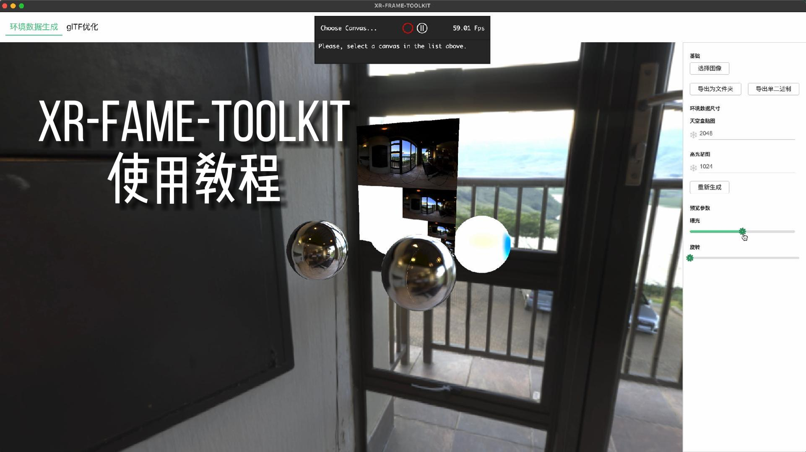

# xr-frame-toolkit

用于微信小程序内置的`xr-frame`系统的可视化工具，目前提供以下两个功能：

1. 通过环境贴图，生成`xr-frame`专用的`env-data`，包含`skybox`、`diffuse sh`和`specular map`，支持打包成单二进制文件。
2. 对`gltf`模型文件进行预处理，优化为`xr-frame`友好的数据结构，同时支持**压缩纹理**和打包为`glb`，能大幅提升加载速度并节省内存，但注意**压缩纹理要求基础库3.0.1**以上的版本。

## 使用

首先下载：

[MacOS版本](https://mmbizwxaminiprogram-1258344707.cos.ap-guangzhou.myqcloud.com/xr-frame/toolkit/xr-frame-toolkit.dmg)  
[Windows版本](https://mmbizwxaminiprogram-1258344707.cos.ap-guangzhou.myqcloud.com/xr-frame/toolkit/xr-frame-toolkit.zip)  

安装/解压打开后，参考下面的视频即可：

>环境数据生成从`00:00`到`00:32`，GlTF优化从`00:32`到`02:25`。

## 开发

**必须先执行**`npm run init`，不能使用`yarn`、`pnpm`等工具。  

开发先执行`npm run dev`，然后再新开一个终端执行`npm run start`。

构建执行`npm run make`。
